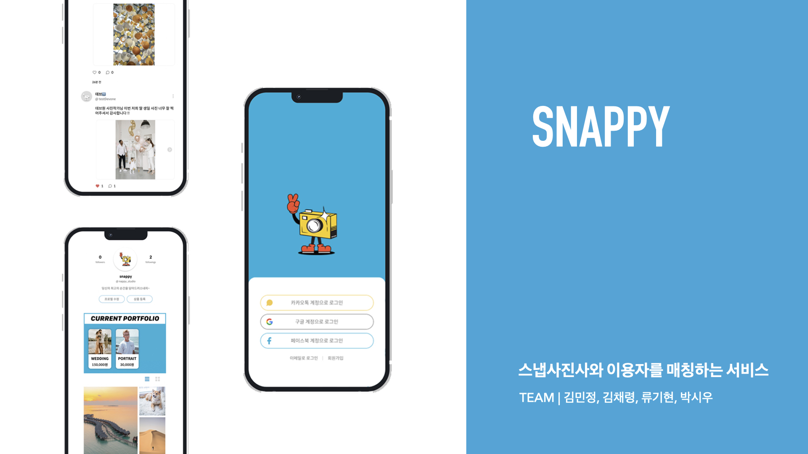
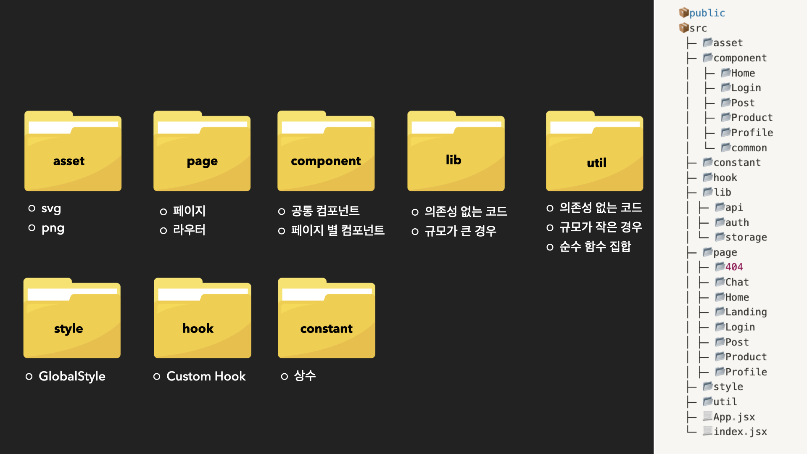
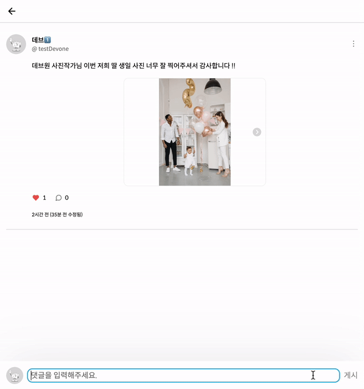
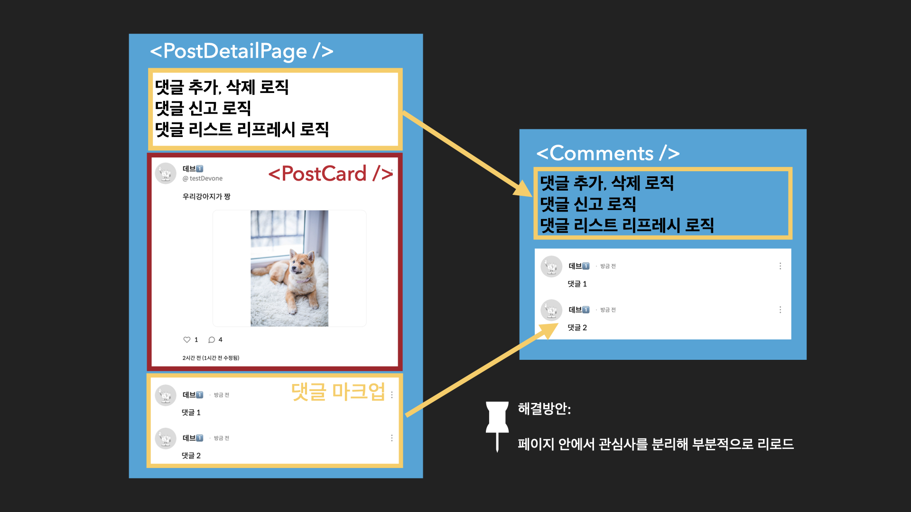
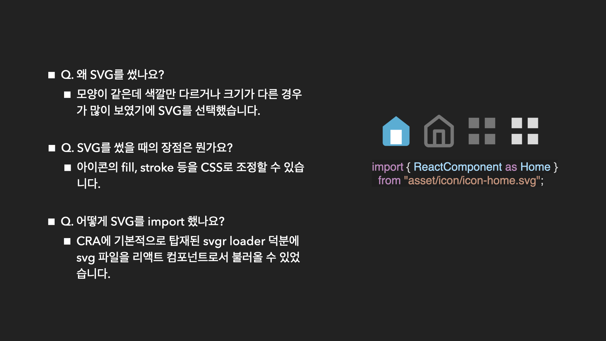
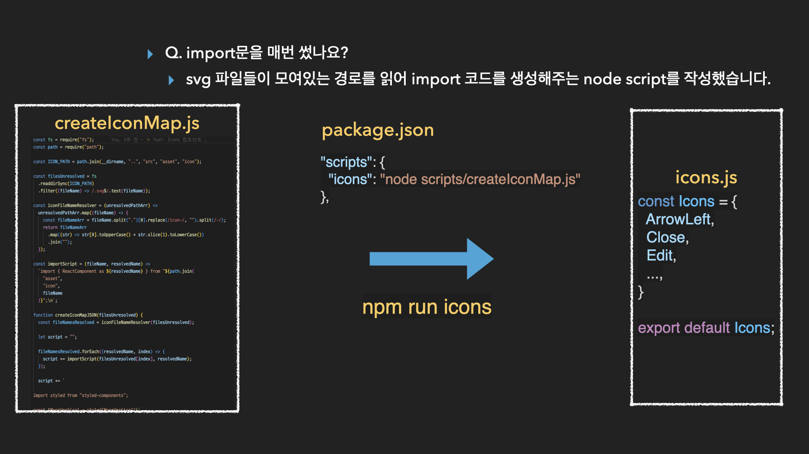

# Snappy!



**[🔗 최종 발표 보러가기](https://www.youtube.com/watch?v=PkcPliZGZ_0)**

## 🚀 배포

- 서비스 링크 : https://devone-snappy.vercel.app/
- 서비스 이용을 위한 예시 테스트 계정
  - ID : snappy@devone.com
  - Password : 123456

<br>

# 1. 프로젝트 개요

- 스냅 사진사와 이용자를 매칭하는 SNS, **Snappy! 📷✨**

```
특별한 추억을 스냅 사진으로 남기고 싶으신가요?
소중한 순간을 예쁘게 담아주실 스냅 사진사를 찾고 계신가요?

Snappy에는 다양한 컨셉과 느낌의 스냅 촬영 전문가가 활동하고 있습니다.
스냅 사진사분들의 포트폴리오를 보시고 맘에 쏙 드는 사진사분들의 서비스를 받아보세요.
```

<br>

# 2. Snappy 팀원 소개 및 역할 분담

|                                      김민정                                      |                                      김채령                                      |                                      류기현                                      |                                     박시우                                      |
| :------------------------------------------------------------------------------: | :------------------------------------------------------------------------------: | :------------------------------------------------------------------------------: | :-----------------------------------------------------------------------------: |
|  |  |  |  |
|              <a href="https://github.com/loafcheck">🔗 GitHub </a>               |              <a href="https://github.com/chaeryun0">🔗 GitHub </a>               |               <a href="https://github.com/geekseal">🔗 GitHub </a>               |           <a href="https://github.com/custardcream98">🔗 GitHub </a>            |

<br>

## 🐳 김민정

- 채팅, 404, 프로필 페이지 및 댓글, 채팅 입력 input 컴포넌트를 담당
- 프로젝트 컨셉 및 기획 수립 (캐릭터, 폰트, 컬러스토리)
- 피그마를 활용해 스내피 UI 제작, asset 수집과 공유
- 스내피 캐릭터 CSS 애니메이션 구현
- 글로벌 스타일과 styled-components theme을 관리
- 스내피만의 404 페이지를 `grid` 를 통해 구현
- 프로필 페이지의 게시물 목록을 갤러리형 / 리스트형으로 구현
  - 갤러리형 구현시 규격화된 정사각형 나열이 아닌 디자인을 가미하여 다양한 크기의 이미지가 나열될 수 있도록 앨범 View를 개발
- 폰트 로드시 local -> wff2 -> wof2 -> ttf 우아한 성능저하법 활용해 최적화

## 🐤 김채령

- 홈 피드, 게시물 작성 및 수정 페이지, 게시물 상세 페이지 담당, GitHub Wiki 작성
- `useValidationInput` Custom Hook 개발하여 상품 등록 및 로그인 페이지에서 `ValidationInput` 컴포넌트를 유연하게 사용할 수 있도록 로직 분리
- 게시물 상세 페이지에서 갱신이 필요한 컴포넌트만 부분적으로 reload 되도록 따로 분리하여 렌더링 최적화
- 재사용성을 고려한 postCard 컴포넌트 개발
- 게시글 입력에 따른 자동 높이 조절 및 이미지 미리보기, 다중 이미지 파일 업로드 구현
- 사용자 편의성을 고려한 이미지 캐러셀 슬라이드 구현
- 댓글 등록, 삭제, 신고 및 댓글 작성 시간 기능 구현
- 좋아요 및 좋아요 취소 기능 구현

## 🦭 류기현

- 내부 구성을 유연하게 조정할 수 있는 Dropdown, Alert 모달 컴포넌트 개발
- 상황에 따라 웹 표준에 알맞게 구현되는 Profile 컴포넌트 개발
- 상태를 받아 그에 따라 활성화/비활성화되는 Button 컴포넌트 개발
- 모달 컴포넌트와 상품 정보를 교류할 수 있는 ProductCard 컴포넌트 개발
- Context API를 활용해 판매 상품 등록과 수정 기능 구현
- 팔로우/팔로잉 목록 페이지
- 홈 피드 무한스크롤 개발

## 🐯 박시우

- 라우팅 및 레이아웃, Top Nav / Global Nav, 유저 검색, 로그인, 회원가입 페이지, 스플레시 페이지 개발
- Backend API 호출이 용이한 useAPI Custom Hook 개발
- 유연한 컴포넌트 설계를 위해 Compound Component 패턴 활용, 로직은 Custom Hook 패턴으로 분리하는 등 유지보수가 용이한 컴포넌트 디자인 리드
- JSDoc 적극적으로 활용해 개발 경험 향상
- SVG 파일 import문을 자동으로 생성해주는 node script 작성
- **팀 리더**로서 참여
  - eslint, prettier, Live Share 등 다양한 툴을 활용해 코드 품질 향상 도모
  - 각 페이지 및 컴포넌트 개발을 적극적으로 서포트

<br>

# 3. 기술 스택 및 개발 환경

- 스택: `React` `styled-components` `axios` `prop-types`
- 개발 환경: `eslint` `prettier`
- 커뮤니케이션: `Discord` `Gather` `Notion`
- 디자인: `Figma` `Adobe Illustrator`

<br>

# 4. 폴더 구조



🔍 컴포넌트의 **체계적인 관리**를 위해 **공통 컴포넌트와 페이지별 컴포넌트 폴더를 분리**했습니다.

<br>

# 5. Snappy 개발 기록

## 5.1. 컴포넌트 설계

- 컴포넌트의 로직과 UI 코드를 분리하기 위해 **Custom Hook 패턴**을 사용했습니다.
- 컴포넌트 UI의 마크업을 유연하게 바꿀 수 있도록 **Compound Component 패턴**을 사용했습니다.

### 5.1.1. Custom Hook - `useAuthInfo`

#### ▶︎ 해결하고자 한 문제

```jsx
import { AuthContext } from "lib/auth/AuthProvider";
import { useContext } from "react";

function Main() {
  const { authInfo } = useContext(AuthContext);
  // ...
}
```

- 로그인한 유저의 정보를 사용해야 하는 경우가 잦았는데, 그럴 때마다 `AuthContext`와 `useContext`를 import해 사용해야 하는 **불편함**이 있었습니다.

- 다양한 값을 가지고 있는 `AuthContext`에서 "유저 정보"만을 원해 `useContext`를 사용한다는 **개발자의 의도를 자연스럽게 담을 수 있다면 가독성이 향상**되지 않을까라는 고민이 있었습니다.

#### ▶︎ 해결

```jsx
/**
 * user info가 필요한 경우 사용하는 Custom Hook
 */
export default function useAuthInfo() {
  const { authInfo } = useContext(AuthContext);
  return authInfo;
}
```

`AuthContext`에서 유저의 정보를 가지고 온다는 단순하지만 의도가 명확히 드러나는 **`useAuthInfo`라는 커스텀 훅을 개발해 사용**했습니다.

```jsx
export default function CommentCard({ authorId }) {
  const { myId } = useAuthInfo();
  const isThisCommentMine = authorId === myId;
  // ...
}
```

`CommentCard`라는 컴포넌트에서 `useAuthInfo` 훅으로 유저의 정보중에 유저 id를 가져와 사용하고 있는 예제입니다.

<br>

### 5.1.2 Custom Hook - `useAPI`

#### ▶︎ 해결하고자 한 문제

- baseURL 세팅, headers 세팅, error handling 등 비동기 통신에 **반복되는 복잡한 로직을 줄이고자** 했습니다.
  - 이를 위해 axios instance를 생성하거나, interceptor로 토큰을 담는 등의 시도를 했으나, **error handling 로직은 여전히 반복**되고 있었습니다.
- React state로써 응답을 관리하려면 **매번 `useState` 훅으로 세팅해 줘야 하는 번거로움**이 있었습니다.

#### ▶︎ 해결

```js
const [isLoading, response, error, request] = useAPI(req.post.remove);
```

- `로딩 중 여부: boolean`, `응답: Object`, `에러: Object`, `통신_요청_함수: () => Promise<Object>`를 return 하는 `useAPI` 훅을 개발해 사용했습니다.
- `useAPI` 호출 시에는 요청과 관련된 정보(HTTP Request body, header)가 담긴 객체를 반환하는 함수가 들어갑니다.
  - 이는 `req`라는 객체로 묶어 자동완성으로 간편하게 사용할 수 있도록 설계했습니다. 위 코드에서는 게시물을 삭제하는 요청을 하기 위해 `req.post.remove` 함수를 넣고 있습니다.

```js
useEffect(() => {
  if (error) {
    alert("게시물 삭제 중 에러가 발생했습니다.");
    console.error(error);
  }
}, [error]);
```

- `useAPI` 훅에서 제공하는 `error` 객체를 사용해 간편하게 에러를 핸들링한 예시입니다.
- 서버에서 주는 에러의 형태가 일정하지 않았으나 관련 로직은 훅 내부에서 모두 처리해 개발 편의성을 향상시켰습니다.

<br>

### 5.1.3. Compound Component - `DropdownModal`


위 사진에 보이는 모달이 `DropdownModal`입니다.

#### ▶︎ Compound Component 패턴을 사용한 이유

- 모달 내부의 버튼들을 유연하게 구성할 수 있어야 합니다.
- 각 버튼 요소에는 `onClick` 등 attribute를 전달해야 합니다.

#### ▶︎ 설계 내용


```jsx
<DropdownModal>
  <DropdownModal.Button onClick={handleDeleteButton}>
    상품 삭제하기
  </DropdownModal.Button>
  <DropdownModal.Button onClick={handleEditButton}>
    상품 수정하기
  </DropdownModal.Button>
  <DropdownModal.Button onClick={handleVisitButton}>
    웹사이트에서 상품 보기
  </DropdownModal.Button>
</DropdownModal>
```

- `모달 > 버튼` 구조의 마크업이 드러난 덕분에 버튼의 위치를 자유롭게 지정할 수 있었습니다.
- `onClick` 이벤트처럼 버튼 요소에 직접 전달해야 하는 attribute도 props drilling 없이 전달할 수 있었습니다.

<br>

### 5.1.4. Compound Component & Custom Hook - `ValidationInput`


#### ▶︎ 각 패턴을 사용한 이유

- `ValidationInput` 컴포넌트는 validation을 진행하고 그 결과에 따라 적절한 메시지를 노출시키거나 통과시키는 로직이 들어갑니다.
- Input과 에러 메시지가 들어가는 markup 패턴이 있습니다.

#### ▶︎ 설계 내용

- 로직은 `useValidationInput` Custom Hook으로, 마크업 및 스타일은 Compound Component 패턴을 가지는 `ValidationInputWrapper`로 코드를 작성했습니다.

- `ValidationInput` 컴포넌트의 자식으로 위치하는 `input` 요소 마크업이 밖으로 노출돼 `input` 요소의 다양한 attribute들을 props drilling 없이, 자유롭게 부여할 수 있었습니다.

<br>

## 5.2. 부분 Reload

사용자가 페이지와 상호작용 시 페이지 전체 데이터를 다시 load하여 재렌더링하는 이슈가 발생했습니다. 이에, 갱신이 필요한 컴포넌트만 따로 분리해 reload 하는 방향으로 개선했습니다.

> 즉 관심사를 분리함으로써 프로그램의 `결합도`를 낮추었습니다.

### 5.2.1. 게시물 상세 페이지

|                            개선 전                            |                            개선 후                            |
| :-----------------------------------------------------------: | :-----------------------------------------------------------: |
|  |  |



#### ▶︎ 문제 원인

- 게시물 상세 페이지(PostDetailPage 컴포넌트)에서 댓글과 관련된 로직 및 마크업을 그대로 가지고 있습니다.

#### ▶︎ 문제 해결

- 댓글과 관련된 로직과 마크업을 `Comments`라는 컴포넌트로 분리하고, 댓글이 작성될 경우 `Comments` 컴포넌트만 load 되도록 했습니다.

<br>

### 5.2.2. 팔로워, 팔로잉 목록 페이지

|                                   개선 전                                   |                                   개선 후                                   |
| :-------------------------------------------------------------------------: | :-------------------------------------------------------------------------: |
|  |  |

앞선 경우처럼 페이지 컴포넌트에서 데이터를 불러오기 때문에 발생한 문제로, 버튼에서 데이터 통신을 담당하도록 컴포넌트를 분리해 해결했습니다.

<br>

## 5.3. SVG 로드

아이콘을 사용할 때 이미지 요소 혹은 CSS Sprite 기법을 사용하지 않고, SVG를 로드해 사용했습니다.

### 접근



Create React App에 기본적으로 탑재되는 Webpack loader인 `svgr`로 svg 파일을 React Component로서 불러올 수 있습니다. 다만 이런 방법을 사용할 경우 SVG 파일들을 일일이 import 해줘야 한다는 번거로움이 있습니다.

### 해결



- **svg 파일들이 위치하는 경로를 읽어 각 파일을 import하고 Icons라는 객체에 넣는 코드를 자동으로 생성**해주는 `createIconMap.js` node script를 작성했습니다.
- `package.json`에 `npm run icons` 스크립트 명령어를 추가했습니다.
- `Icons` 객체를 통해 아이콘을 사용할 수 있도록 관리했습니다.

<br>

## 6. Snappy 컨벤션 및 협업 방식

- [Github Wiki](https://github.com/likelion-devone/snappy/wiki) 통해 개발 문화 및 컨벤션을 공유했습니다.
- 한 달간 [총 22번의 회의](https://team-devone.notion.site/147176110e0348889002adbae548c624)를 진행했습니다.
  - 매 회의마다 Live Share를 활용해 Troubleshooting을 함께했습니다.
- `eslint`, `prettier` 등을 활용해 일정 수준의 코드 품질을 유지했습니다.
- Git-flow 방식을 활용해 협업을 진행했습니다.
  - 단, 프로젝트의 규모를 감안해 `main`, `develop`, `feat` 브랜치만 사용했습니다.
  - `feat` 브랜치는 팀원간 이슈 공유를 위해 Github issue를 통해서만 생성했습니다.

<br>

## 7. Hello Nappy

<p>
  
  
</p>

Snappy의 얼굴 Nappy를 소개합니다!
